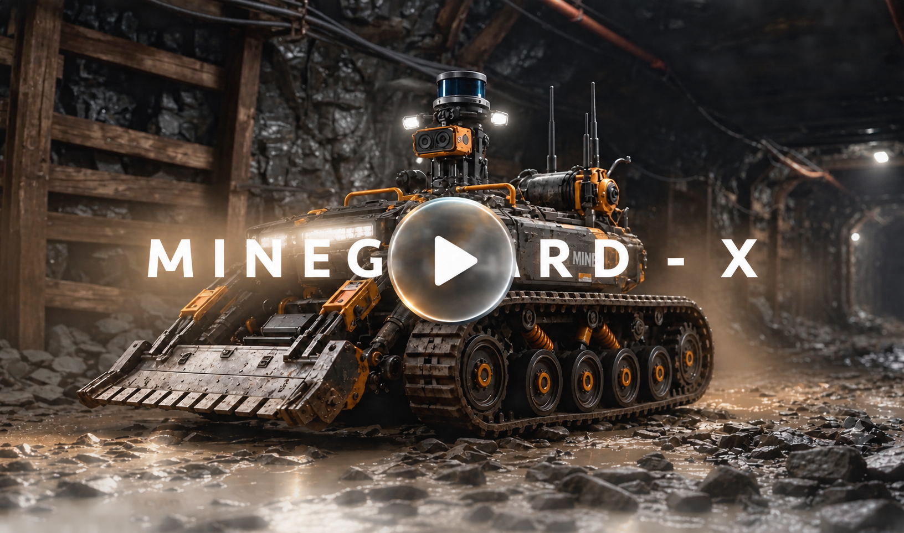

# 🇮🇳 Smart India Hackathon 2026 — MineGuard X

### AI-Powered Autonomous Mine Exploration, Hazard Detection & Rescue Rover

  

  ▶️ <b>Click the video above to watch the MineGuard X demonstration</b>

> **Explore. Detect. Map. Rescue.**

MineGuard X is an intelligent autonomous mine-rescue rover designed to operate in hazardous, unstable, and inaccessible mining environments where sending humans first can be dangerous.

The system combines **all-terrain mobility, environmental sensing, AI-based perception, mine mapping, worker detection, hazard identification, communication, and remote monitoring** into a unified platform for mine safety and rescue operations.

---

## 🚨 The Problem

Mining environments can become extremely dangerous due to:

- Mine collapses
- Toxic and combustible gases
- Unstable and uneven terrain
- Fire and thermal hazards
- Poor visibility
- Trapped or missing workers
- Communication limitations underground

During an emergency, rescue teams often have limited information about the actual conditions inside the mine.

**MineGuard X is designed to enter hazardous areas first, gather critical information, and provide rescuers with actionable situational awareness before human intervention.**

---

## 🤖 How MineGuard X Works

MineGuard X continuously collects information from its onboard sensors while navigating through the mine.

**Sensors → Data Collection → Sensor Fusion → AI Perception → Hazard & Worker Detection → Mine Mapping → Risk Assessment → Control Center → Rescue Decision Support**

The rover can analyze its surroundings, identify potential hazards and workers, map explored areas, and communicate important information to the control center.

---

# ⭐ USP — Why MineGuard X?

### **MineGuard X is not just a surveillance rover. It is a mine-intelligence and rescue-assistance platform.**

Most robotic inspection systems focus primarily on mobility, video surveillance, or individual sensor measurements.

MineGuard X brings multiple capabilities together into one coordinated system:

**Navigate → Sense → Understand → Map → Locate → Communicate → Assist**

### 🔹 1. Multi-Functional Rescue Platform

Instead of deploying separate systems for inspection, environmental monitoring, worker tracking, and mapping, MineGuard X combines them into a single platform.

It integrates:

- 🤖 Autonomous mobility
- ☣️ Environmental monitoring
- 🧠 AI-based perception
- 🗺️ Mine mapping
- 👷 Worker detection
- 🪨 Collapse detection
- 📡 Communication
- 🚨 Emergency alerts

---

### 🔹 2. Hazard-Aware Mine Mapping

MineGuard X is designed to go beyond simply creating a map.

Important information can be associated with specific locations:

<table align="center">
  <tr>
    <td>🟢 <b>Safe Areas</b></td>
    <td>🟡 <b>Caution Zones</b></td>
    <td>🔴 <b>Hazard Zones</b></td>
    <td>☣️ <b>Gas Detection</b></td>
  </tr>
  <tr>
    <td>🪨 <b>Collapse Locations</b></td>
    <td>👷 <b>Worker Locations</b></td>
    <td>🤖 <b>Rover Position</b></td>
    <td>🧭 <b>Accessible Routes</b></td>
  </tr>
</table>

This transforms the mine map into a **real-time situational-awareness system** for rescue teams.

---

### 🔹 3. Worker + Hazard Intelligence

MineGuard X can combine worker-location information with environmental and spatial data.

For example:

**Worker Location + Gas Hazard + Mine Map → Risk Awareness**

This allows the control center to understand not only **where a worker is**, but also the conditions surrounding them.

---

### 🔹 4. Designed for Real Mine Terrain

Unlike robots designed primarily for controlled indoor environments, MineGuard X is designed around the physical challenges of mining environments.

Its mobility system incorporates:

- High-traction wheels
- Specialized wheel geometry
- Suspension
- High ground clearance
- Mud-resistant design
- Debris-tolerant construction

This enables the rover to operate across **rocky, muddy, uneven and debris-filled terrain**.

---

### 🔹 5. Multi-Sensor Situational Awareness

MineGuard X does not depend on a single source of information.

The system can combine:

- Cameras
- Gas sensors
- Environmental sensors
- Distance sensors
- Motion / worker detection
- IMU and rover telemetry
- Mapping information
- Worker safety systems

Combining multiple sources can provide more comprehensive environmental awareness and reduce dependence on a single sensor.

---

### 🔹 6. Communication-Aware Architecture

Underground mines can create challenging communication conditions.

MineGuard X is designed to work with a **distributed communication network**, allowing information to be relayed through network nodes when direct communication with the control center is difficult.

Communication is therefore treated as a core part of the rescue architecture rather than an external add-on.

---

### 🔹 7. Human-in-the-Loop Rescue

MineGuard X is designed to **assist rescue teams, not replace them**.

The rover provides information such as:

- Where it has explored
- Where hazards were detected
- Where workers may be located
- Which areas may be blocked
- Which routes may be accessible

Critical rescue decisions remain under human supervision.

> **The rover explores the danger. Humans make the final decision.**

---

## 🏆 Key Differentiating Factors

| Factor | MineGuard X |
|---|---|
| Primary Focus | Mine exploration, safety & rescue assistance |
| Mobility | Rocky, muddy, uneven & debris-filled terrain |
| Perception | Multi-sensor environmental & visual perception |
| Mapping | Hazard-aware mine mapping |
| Hazard Awareness | Gas, environmental & structural hazards |
| Worker Awareness | Worker detection & location tracking |
| Communication | Distributed underground communication |
| Rescue Support | Worker location + hazard awareness + route assistance |
| Operation | Autonomous capabilities with human supervision |
| Architecture | Rover + AI + sensors + network + control center |
| Design Philosophy | Information before human intervention |

---

## 🛞 Designed for Difficult Terrain

MineGuard X uses a specialized **wheel, suspension and chassis design** to travel through challenging mining environments.

The rover is designed to handle:

- 🪨 Rocky surfaces
- 🟤 Mud
- 🧱 Loose debris
- ⛰️ Uneven and inclined terrain
- 🕳️ Collapsed areas
- 🚧 Narrow passages

Its suspension helps maintain wheel contact over uneven terrain, while the specialized wheel design provides improved traction and helps reduce mud and debris accumulation.

### Rover Design

  

  
  

  
  

---

## ☣️ Hazard Detection & Mine Mapping

MineGuard X monitors its surroundings for potentially dangerous conditions.

The rover can detect and report:

- ☠️ Hazardous gases
- 🌡️ Environmental abnormalities
- 🪨 Mine collapses
- 🚧 Blocked passages
- ⚠️ Unsafe areas

Detected hazards can be associated with their locations on the mine map, allowing the control center to understand where dangerous regions are located.

The generated mine map can provide information about **safe areas, hazardous zones, collapse locations, worker positions, rover position and accessible routes**.

---

## 👷 Worker Detection & Rescue Assistance

MineGuard X can work alongside connected worker safety systems to help locate workers inside the mine.

During a mine collapse, the rover can:

1. Enter and inspect the affected area.
2. Detect possible workers or survivors.
3. Identify surrounding hazards.
4. Mark their location on the mine map.
5. Identify accessible routes.
6. Send information to the control center.
7. Assist rescuers in planning their approach.

> **Give rescuers information before they enter a dangerous environment.**

---

## 📡 Control Center

The rover communicates with a remote control system where operators can monitor:

- 🗺️ Mine map
- 🤖 Rover location
- 👷 Worker locations
- ☣️ Detected hazards
- 🪨 Collapse locations
- 📊 Sensor data
- 🚨 Emergency alerts
- 🧭 Possible safe routes

This creates a unified view of the mine and helps rescue teams respond more effectively.

---

## 🏭 Mine Visit & Field Study

The MineGuard X concept is inspired by real mining environments and the challenges faced by workers and rescue teams.

Our mine visit helped us understand:

- Real mine terrain and accessibility
- Working conditions
- Safety challenges
- Underground infrastructure
- Communication limitations
- Potential applications for autonomous systems

### 📸 Mine Visit Gallery

  
  
  

---

## 🎯 Our Goal

MineGuard X aims to reduce the risks faced by mine workers and rescue teams by using robotics and intelligent sensing to explore hazardous areas before humans enter them.

### **Explore → Detect → Map → Locate → Assist → Rescue**

---

## 🚀 Future Scope

- Advanced autonomous navigation
- Real-time 3D mine mapping
- Improved AI-based hazard detection
- Multi-rover coordination
- Long-range underground communication
- Advanced worker tracking
- Autonomous return-to-base
- Robotic debris interaction
- Cloud-based mine monitoring
- Predictive hazard analysis
- Digital twin of the mine environment

---

## 🌍 Vision

> ### **"The first machine entering a dangerous mine shouldn't have to be a human."**

MineGuard X brings together **robotics, AI, electronics, sensing, mobility and communication** to create a safer and more intelligent approach to mine exploration and rescue.

---

### ⛏️ MineGuard X

**Explore. Detect. Map. Rescue.**

### 🇮🇳 Built for Smart India Hackathon 2026

